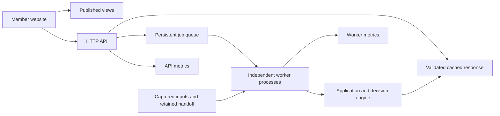

# System map

SquadOpt is one installed, layered Python package with separate HTTP and worker processes,
and a React website. The [dependency rules](dependency_rules.md) define the enforced import
order; [ADR 0001](decisions/0001-modular-monolith.md) explains the modular monolith choice.
This map describes the enterprise transition source. The earlier graph/count audit remains
available in Git at `6ca49686:docs/architecture/system_map.md`.

## Boundaries

| Area | Responsibilities and dependency direction |
| --- | --- |
| `contracts` | Player positions, required projection columns and stable ordering; imports no engine layer |
| `data`, `features`, `prediction` | Captured data, features and projections |
| `optimization`, `planning` | Decisions and plans; shared constraints/selection/verification live in `optimization.decisions` |
| `evaluation` | Scoring, promotion policy and bootstrap statistics shared by experiments and backtests |
| Research packages | Uncertainty, scenarios, risk, search, preflight, recalibration, backtests and experiments; obey the declared layer order |
| `live` | Domain records, decisions, advice and settled operational calculations |
| `application` | Typed workflows, publication/evidence builders and advice capabilities; no platform or script imports |
| `platform` | Filesystem, capture, queue, process pool, metrics, backup and command adapters |
| `api` | HTTP translation; engine access goes through platform/application boundaries |
| `web` | Static publication reader, validated HTTP advice client, member selection and rendering |

The five former import exceptions are removed: vocabulary moved to `contracts.players`,
and the common policy/statistics moved from `experiments` to `evaluation`. Original import
locations retain compatibility exports. `lint-imports` enforces the order with zero baseline
exceptions and a separate prohibition on direct API-to-engine imports.

## Advice request

API and workers share durable queue/cache storage. A permanent OS-backed lock serializes
queue transitions; recovery retains queued intent and isolates corrupt records. Attempt
identity fences stale workers from writing a terminal response. See
[queue recovery](queue_recovery.md) and [advice boundaries](advice_boundaries.md).
Worker counters remain in the worker process and are scraped independently from the API.

## Publication and recovery

Capture adapters produce private snapshots. Typed application builders consume captured
inputs to produce evidence, retained handoffs, league views, the site and scoreboard.
Platform adapters own network/Git operations and process workers; repository scripts retain
compatible CLI entry points. The installed weekly runner journals stages and verifies
artifacts before resuming a run. Acceptance of that runner is tracked in the
[transition record](enterprise_transition.md).

Projection handoffs retain their capture/content-addressed originals before the compatibility
alias changes. Backup inventory and trusted receipts establish byte integrity; restore into
an empty target checks it again. Neither Git nor the public website replaces private-state
backup. See [recovery](backup_recovery.md) and [operations inventory](operations_inventory.md).

## Website responsibilities

The member route owns loading/error states. Dedicated hooks own publication queries and
advice selection/job state. The member view composes pure rendering sections. Runtime
publication validators and shared errors are independent of HTTP loaders. Compatibility
exports preserve existing callers. See [member page boundaries](member_page_boundaries.md).

## Verification and limits

Run `lint-imports`, strict mypy, Ruff and the full offline Python suite; then web type/lint,
unit, production-build and browser gates. Installed-package tests verify publication does
not depend on `scripts/`. Opt-in probes establish cross-language publication, real
API/worker/browser, container, and concurrent-load behavior in their measured environments.

Remote storage locking, restart survival, external restore, scheduled-run delivery and a
production replica count require acceptance in that environment. A local pass does not
establish those facts. Scientific promotion still requires its own measured evidence.
Wide legacy package exports and remaining research scripts are compatible existing seams;
this transition does not rename immutable measurements or silently enable experimental models.
